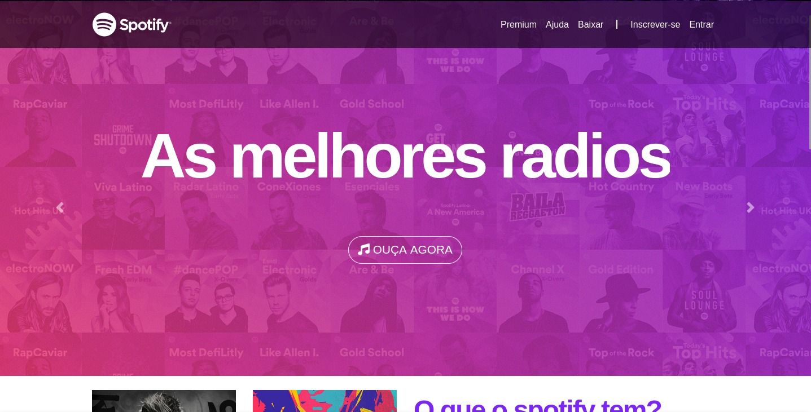
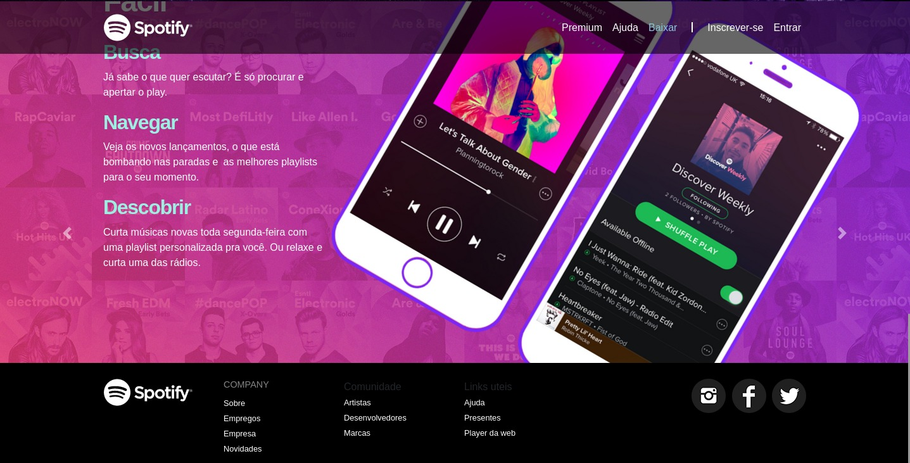
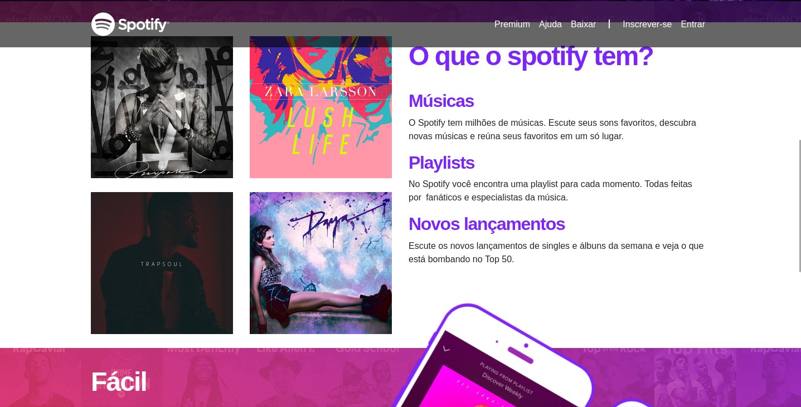
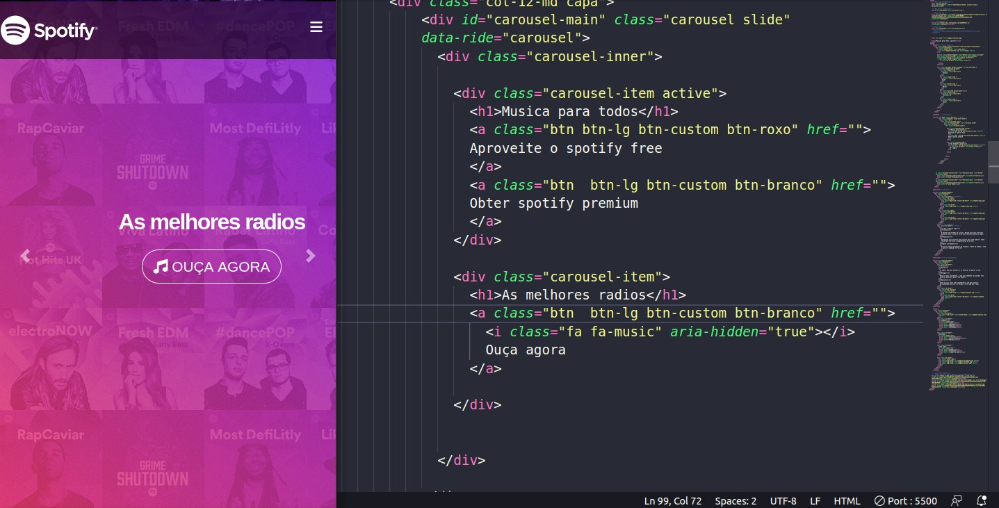

# Spotify main page clone (Front end)
A idea do projeto é clona a páhina inicial do spotify(O site antigo). 

## Tecnologias
- Css
- Html
- Bootstrap 4
- Medias queries

 ## Objetivo
  O objetivo do projeto foi puramente aprendziado
  - Aprender sobre bootstrap 4.
  - Uso de medias queries.
  - Integração do css com o bootstrap 4
  - Normalize css

## Projeto
O projeto é um arquivo.html com um estilo.css

